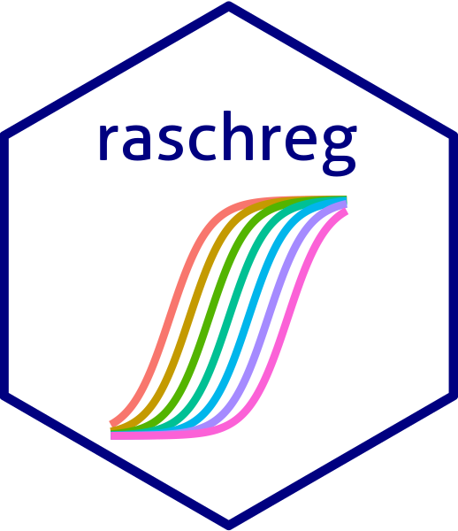

# raschreg 

***
## Overview
The library _raschreg_ was created an mantained by a group of statisticians from Universidad de la República, Uruguay. It's primary pourpose is to provide R users with a framework for Item Response Theory (IRT) models, allowing for the possibility to include regression effects for the person parameters.   
***
## The models
Having a set of _p_ items (Y<sub>1</sub>, Y<sub>2</sub>, ..., Y<sub>p</sub>) the probabilistic structure for the models is:   
logit(P(Y<sub>j</sub>=1|&theta;<sub>i</sub>)) = &alpha;<sub>j</sub>(&theta;<sub>i</sub> - &delta;<sub>j</sub>)   
&theta;<sub>i</sub> ~ N(0, 1)   
Where &theta;<sub>i</sub>, &delta;<sub>j</sub> and &alpha;<sub>j</sub> represent person, difficulty and discrimination parameters respectively.

_raschreg_ provides a set of functions to fit, analyse and plot IRT models intended to analyse binary items. Currently supported models are:   
* Rasch model (&alpha;<sub>1</sub>=&alpha;<sub>2</sub>=...=&alpha;<sub>p</sub>=1)
* Rasch model with free discrimination parameter (&alpha;<sub>1</sub>=&alpha;<sub>2</sub>=...=&alpha;<sub>p</sub>)
* Two parameter logistic model   

All previous models allow the posibility to incorporate explanatory variables (qualitative or quantitative) for person parameters.   
In this case:   
&theta;<sub>i</sub> ~ N(X'&beta;, 1)   
***
## Features
1. Models are estimated by maximum marginal likelihood, integrating person parameters via Laplace approximation. Estimated models are stored in _rasch_ objects similarly to _lm_ or _glm_ objects.   
2. Usual R methods for linear models (lm, glm) are implemented, such as:   
    * coef
    * summary
    * vcov
    * anova
    * update
    * among others
3. Stored _rasch_ objects con be visualized using:
    * Item characteristic curves and information curves
    * Person item maps
    * Forest plots
***
## Installation
You can install the development version from GitHub using library [devtools](https://CRAN.R-project.org/package=devtools):   
```{r }
devtools::install_github("nando11235813/raschreg")
```
